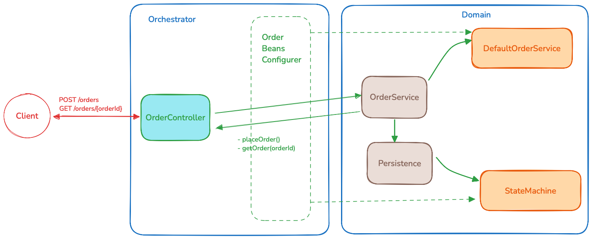

# Tradex - Trading Order Matching Engine

## Project Structure

```
Tradex/
├── Domain/        # Core business logic and matching engine
└── Orchestrator/  # REST API and application orchestration
```

### Overview



## Order Matching Rules

1. **Price Priority**
    - Buy orders match with the lowest priced sell orders first
    - Sell orders match with the highest priced buy orders first

2. **Time Priority**
    - When multiple orders exist at the same price, they are matched in order of arrival (FIFO)

3. **Partial Matching**
    - Orders can be partially filled
    - Remaining quantity stays in the order book until matched
    - PendingAmount field shows the remaining quantity to be matched

## API Documentation

### Place Order

Place a new buy or sell order into the matching engine.

**POST** `/orders`

**Request:**

```json
{
  "asset": "BTC",
  "price": 43251.00,
  "amount": 1.0,
  "direction": "SELL"
}
```

**Response:**

```text
201 Created
Location: 891f359a-4f88-45f8-8416-c5aa6a51e268
```

| Field     | Type   | Description                                 |
|-----------|--------|---------------------------------------------|
| asset     | string | The trading symbol (e.g., APL, GOOGL)       |
| price     | number | The limit price for the order (must be > 0) |
| amount    | number | The quantity to trade (must be > 0)         |
| direction | string | Order direction: "BUY" or "SELL"            |

---

### Get Order Status

Retrieve the current state of an order

**GET** `/orders/{orderId}`

**Response:**

```json
{
  "id": "891f359a-4f88-45f8-8416-c5aa6a51e268",
  "timestamp": "2025-06-11T18:34:18.226255Z",
  "asset": "BTC",
  "price": 43251.0,
  "amount": 1.0,
  "direction": "SELL",
  "pendingAmount": 1.0,
  "trades": []
}
```

#### Error Responses

#### Order Not Found (404 Not Found)

```json
{
  "message": "Order with ID 891f359a-4f88-45f8-8416 not found.",
  "status": 400
}
```

## Usage Examples

### Place an Order

```bash
curl --location 'http://localhost:8080/orders' \
--header 'Content-Type: application/json' \
--data '{
    "asset": "BTC",
    "price": 43251.00,
    "amount": 1.0,
    "direction": "SELL"
}'
```

### Check Order Status

```bash
curl --location 'http://localhost:8080/orders/891f359a-4f88-45f8-8416-c5aa6a51e26811'
```
